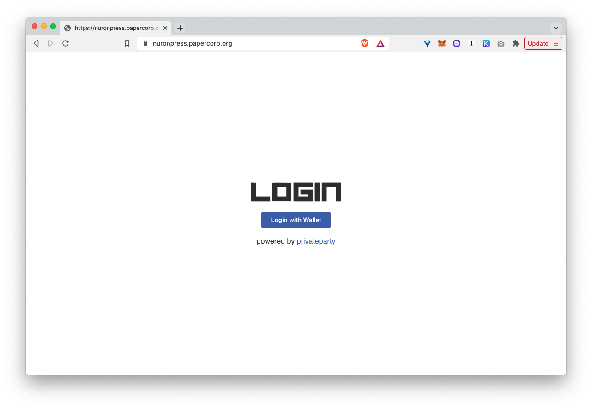
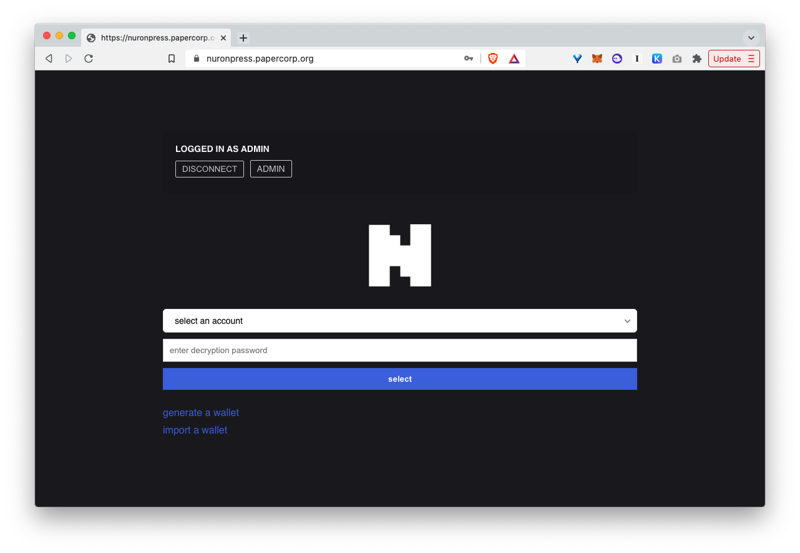
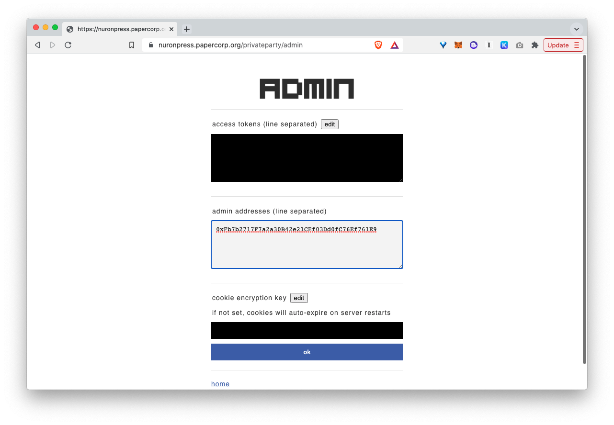
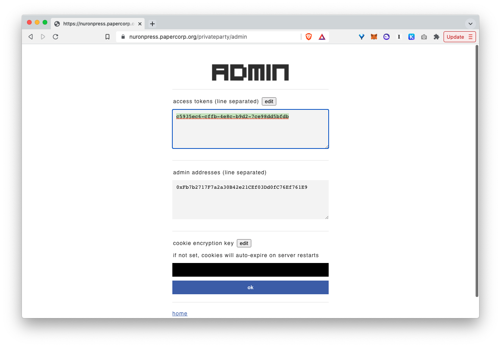
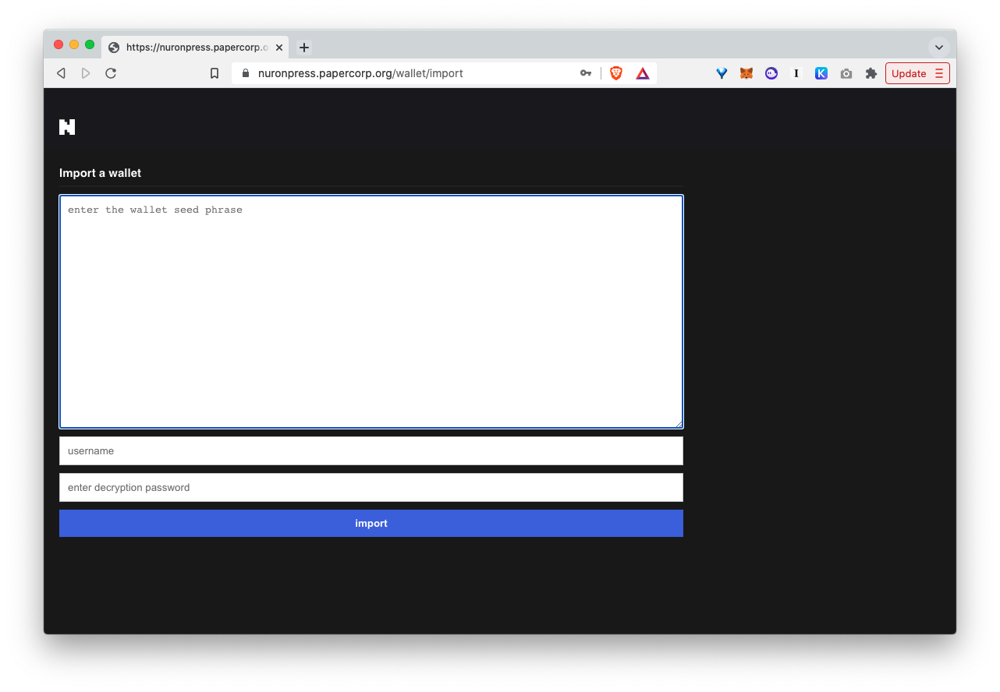
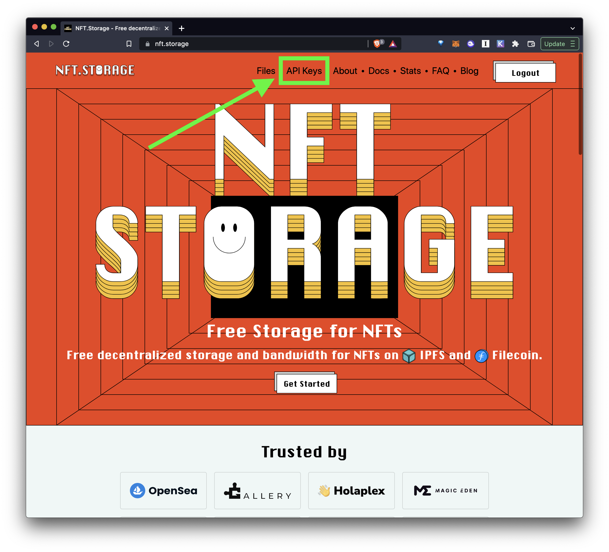
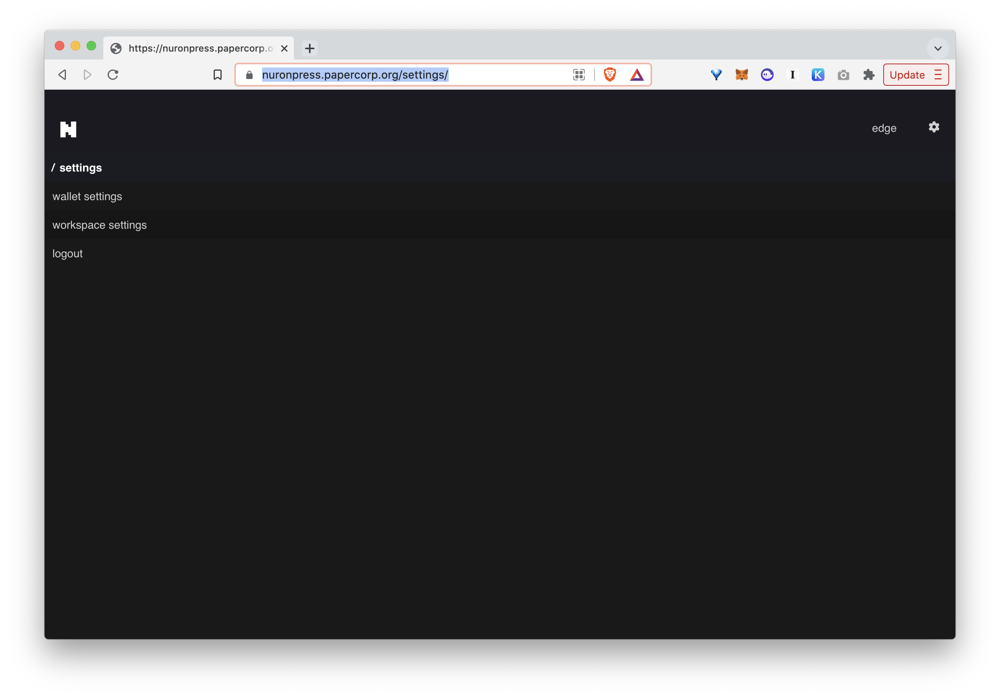
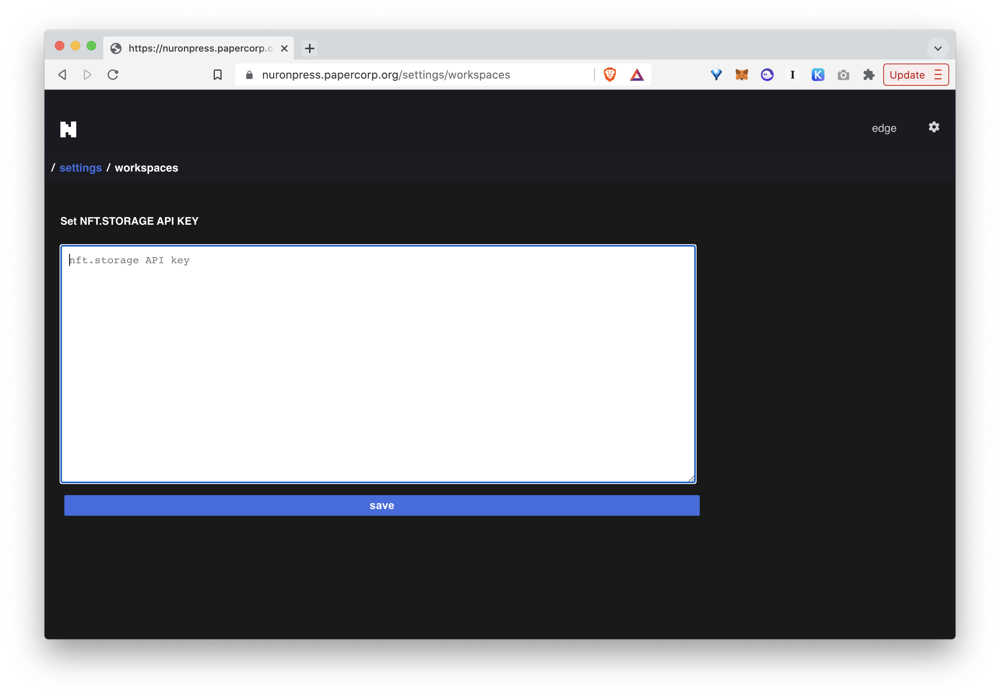

# nuron

> NFT operating system

<div class='videoWrapper'>
  <iframe width="1280" height="720" src="https://www.youtube.com/embed/YdCiSXfxQlI" title="YouTube video player" frameborder="0" allow="accelerometer; autoplay; clipboard-write; encrypted-media; gyroscope; picture-in-picture" allowfullscreen></iframe>
</div>


## what is nuron?

Nuron is an **open source** and **self-hosted** server that **takes http requests and turns them into nfts.** Because of this simplicity, nuron is extremely versatile:

1. Publish an nft collection with varying minting conditions
2. Build an on-demand minting app
3. Build an entire NFT platform of your own
4. Many more

There are many benefits to NOT having to rely on a 3rd party service provider to host and manage all your NFTs:

1. If you can imagine something, you can build it. No need to ask for permission.
2. Completely opem license (MIT licensed), which means you can build an entire business or an entire platform using Nuron. Treat Nuron like an open source database system.

## how does nuron work?

- **What it does:** Nuron is just a web server that takes an HTTP request and creates NFTs that can be instantly minted to the blockchain.
- **What it doesn't do:** Nuron itself DOES NOT mint tokens. It simply creates signed scripts, which then can be minted by the minters. To use an analogy, Nuron creates "coupons" that can be "claimed" by anyone to mint to the blockchain.
- **Creators can create unlimited tokens for Free:** By separating the "creating" of tokens from the "minting", the NFT creator (whether it's the app that creates tokens, or an NFT creator who publishes a collection) DOES NOT pay anything. It's the minters who pay transaction fees to "mint" to the blockchain.
- **Super powerful minting strategies:** Nuron uses [Cell protocol](https://cell.computer) for the smart contract. Cell is an extremely flexible NFT protocol that lets you specify all kinds of minting conditions to NFTs.

---

# features

## admin UI

Nuron ships with a built-in admin interface, so the administrator can easily browse and manage all the NFTs through a single dashboard like navigating a file system.

## one-stop solution

Nuron has everything built-in. Once you run a Nuron node, Nuron takes care of every step of the entire NFT workflow:

1. **Contract deployment:** One-click deployment of contracts that **you own**.
2. **Token creation:** Programmatically create tokens
3. **Token storage:** Stores the offchain tokens in an internal file system and a portable database (powered by SQLite)
4. **Minting UI:** A default minting interface
5. **Exportable workspaces:** Sometimes you may want to just use Nuron to create tokens and download the entire workspace, so you can publish on a separate domain. This is also easiliy possible.

## authentication

Nuron was designed to solve the authentication problem. Basically Nuron adds an authentication layer (powered by [Privateparty](https://privateparty.papercorp.org)) to Nuron.

Witn Nuron you can secure your Nuron endpoint behind:

1. Cookie authentication: Login with an admin
2. Access token authentication: Set whichever access token you want, and make remote requests with the token

## nuron anywhere

Because Nuron is just a web server on the Internet that takes HTTP requests and creates NFTs, you can build all kinds of apps that print and manipulate NFTs **from anywhere**:

1. **Web apps:** Build on-demand NFT minting apps, NFT management apps, or whatever. Because nuron can be accessed from anywhere over the web, there is no difference between building a regular web app.
2. **Mobile apps:** Simply make requests from your app to your Nuron server to print NFTs. No need for the app to have a wallet baked in, because the remote  Nuron server will print all the tokens.
3. **IoT apps:** Bake authentication tokens into each device and they can remotely make requests to your Nuron to create NFTs.
4. **Autonomous bots:** build bots that can make requests to Nuron to create NFTs.

---

# install

## 1. install nuron and run

```
git clone https://github.com/cell-org/nuron.git
cd nuron
npm install
npm start
```

> See the `package.json` file to see what each NPM script does.

## 2. configure nuron

Open your Nuron server. It's running on http://localhost:42000, but you will probably want to use a custom domain to point to it, since you're trying to access this remotely. Get a custom domain and point to http://localhost:42000

If you're not familiar with running your own domain, check out the following articles:

1. **Running nginx:** https://www.digitalocean.com/community/tutorials/how-to-install-nginx-on-ubuntu-20-04
2. **Support HTTPS with LetsEncrypt:** https://www.digitalocean.com/community/tutorials/how-to-secure-nginx-with-let-s-encrypt-on-ubuntu-20-04

### login

First, login with your wallet (At this point you can login with ANY wallet since no admin role has been set yet).



Once you login, you will see the following screen:



Click the "Admin" button to go to the admin page.

### set yourself as an admin

We will need to set the admin role, so only you can login from now on.

Enter your wallet address to the admin textarea (You can enter multiple)




### add an access token



To remotely access the Nuron RPC server, you will need an access token. Click "edit" on the access token field, and add access tokens (Access tokens are like passwords so DO NOT share it with anyone, and try to use a token that cannot easily be guessed, you can use random string generators like https://www.uuidgenerator.net/)

### import a wallet

Now come back to home page, and import (or generate) a wallet seed phrase.

> The wallet MUST be the same wallet you deploy your Cell contracts with at https://c0.cell.computer



Set a username and a decryption password for the wallet and save.

The seed phrase will be encrypted and stored on Nuron, and will only be decrypted when you connect a wallet from the Nuron web interface, or when you programmatically connect (shown below). 

### connect to IPFS

Nuron currently uses [nft.storage](https://nft.storage) to pin your NFT files for free.

First go to nft.storage, get an account, and create an API key:



Now come back to Nuron, click the gear icon at the top right corner to go to the settings page:



From there, click the "workspace settings", and you'll land on a page where you can save the NFT.STORAGE API KEY.



Paste the API key and save. Now you're all ready to go!


---

# quickstart

## 1. install

Follow the instructions in the the install section to set up Nuron.

## 2. IPFS

Nuron uses [nft.storage](https://nft.storage) to publish files to IPFS. To use the nft.storage API you will need an API key.

Sign up to nft.storage (100% free), get an API key, and come back.

## 3. create NFTs programmatically

### easy way

The fastest way to get started is to clone: https://github.com/cell-org/nuron-nodejs-demo

```
git clone https://github.com/cell-org/nuron-nodejs-demo.git
```

Once you have downloaded the repository, go into the directory and install dependencies:

```
cd nuron-nodejs-demo
npm install
```

Then, open the file `nuron.config.js`, which looks something like this:

```javascript
module.exports = {
  node: {
    nuron: {
      url: "",
      token: ""
    }
  },
  key: "m'/44'/60'/0'/0/0",
  workspace: "",
  domain: {}
}
```

The config file is used to:

1. Declare the remote nuron node we will be connecting to
2. Identify the smart contract we will be minting to

To set the config:

1. Copy and paste your Nuron HTTPS URL (For example https://nuron.papercorp.org), at `node.nuron.url`
2. Copy and paste the access token you generated while setting up Nuron, at `node.nuron.token`
3. Replace the empty `domain` object with the domain for your NFT contract (You can find this on your Nuron `contracts` page)
4. Set the `workspace` attribute. The workspace attribute is the folder you will use to store the NFTs you print for this connection.

The result may look something like this:


```javascript
module.exports = {
  node: {
    nuron: {
      url: "https://nuron.papercorp.org",
      token: "acb7c677-a206-34d1-b381-bc2ef1ed41b4"
    }
  },
  key: "m'/44'/60'/0'/0/0",
  workspace: "avatars",
  domain: {
    "address": "0x7e36f7c49109bede172ae746d2c5dda8f2160044",
    "chainId": 4,
    "name": "Hello Cell"
  }
}
```

Now you're ready to go! First check the `index.js` file, which is the program that will make requests to the configured Nuron and print NFTs:

```javascript
const config = require('./nuron.config.js')                               // Import the nuron.config.js we wrote above
const { createAvatar } = require('@dicebear/avatars');                    // The avatar generation library
const style = require('@dicebear/open-peeps');                            // The avatar generation library (part 2)
const Nuron = require('nuronjs');                                         // Import Nuronjs => This is the client that will let you communicate with your remote Nuron server
(async () => {
  const nuron = new Nuron(config)                                         // Initialize a Nuron client with the config
  await nuron.fs.rm("*")                                                  // Clean up the workspace file system (optional. only if you want to start from scratch)
  await nuron.db.rm("token", {})                                          // Clean up the workspace database (optional. only if you want to start from scratch)
  for(let i=0; i<10; i++) {                                               // We will create 10 NFTs, so loop 10 times
    let svg = createAvatar(style, { seed: i.toString() });                // Create the avatar SVGs using the dicebear library, using the loop index as the seed.
    let svg_cid = await nuron.fs.write(Buffer.from(svg))                  // Write the SVG file to the workspace file system (will be stored under the "fs" folder in the workspace). Returns the IPFS CID of the stored SVG
    let metadata_cid = await nuron.fs.write({                             // Create and write a metadata file to the file system, using the SVG CID as well as the rest of the standard attributes like name, description, etc. Returns the IPFS CID of the metadata
      name: `${i}`,
      description: `${i}.svg`,
      image: `ipfs://${svg_cid}`,
      mime: { [svg_cid]: "image/svg+xml" }
    })
    let token = await nuron.token.create({ cid: metadata_cid })           // Create a token from the metadata CID
    await nuron.db.write("token", token)                                  // Write the created token to the current workspace database
    await nuron.fs.write(token)                                           // Write the created token to the current workspace file system
    console.log(`pinning item ${i}`)
    await nuron.fs.pin(svg_cid)                                           // Publish (pin) the SVG file to IPFS
    await nuron.fs.pin(metadata_cid)                                      // Publish (pin) the metadata file to IPFS
    console.log(`[${i}] created token`, token)
  }
  console.log("buliding web")
  await nuron.web.build()                                                 // Build a private NFT collection site from the files and the database
  console.log("publishing to production")
  await nuron.web.publish()                                               // Copy the entire workspace to a "published" folder, which will be available to the public over the web.
  console.log("finished")
})();
```

Now that you understand what it's doing, run the code:

```
node index
```

The app will loop 10 times and make requests to Nuron, and Nuron will create and store all the files on the server.


### harder way

But if you want to follow along and code yourself, follow along:

#### 1. Initialize a project

First, create a new folder and initialize the project:

```
mkdir nuron-nodejs-demo
cd nuron-nodejs-demo
npm init
```

Second, let's install some NPM dependencies. We will use the [Dicebear](https://avatars.dicebear.com/) library to automatically generate SVG avatars. And we will need to install `nuronjs` in order to communicate with our Nuron server:

```
npm install @dicebear/avatars @dicebear/open-peeps nuronjs
```

#### 2. Create a config file

Third, create a config file named `nuron.config.js` and paste int the following:

```javascript
module.exports = {
  node: {
    nuron: {
      url: "",
      token: ""
    }
  },
  key: "m'/44'/60'/0'/0/0",
  workspace: "",
  domain: {}
}
```

The config file will be used to:

1. Declare the remote nuron node we will be connecting to
2. Identify the smart contract we will be minting to

To set the config:

1. Copy and paste your Nuron HTTPS URL (For example https://nuron.papercorp.org), at `node.nuron.url`
2. Copy and paste the access token you generated while setting up Nuron, at `node.nuron.token`
3. Replace the empty `domain` object with the domain for your NFT contract (You can find this on your Nuron `contracts` page)
4. Set the `workspace` attribute. The workspace attribute is the folder you will use to store the NFTs you print for this connection.

The result may look something like this:


```javascript
module.exports = {
  node: {
    nuron: {
      url: "https://nuron.papercorp.org",
      token: "acb7c677-a206-34d1-b381-bc2ef1ed41b4"
    }
  },
  key: "m'/44'/60'/0'/0/0",
  workspace: "avatars",
  domain: {
    "address": "0x7e36f7c49109bede172ae746d2c5dda8f2160044",
    "chainId": 4,
    "name": "Hello Cell"
  }
}
```

#### 3. Write the NFT printing code

Now we're ready to write the actual NFT printing logic. Create a file named `index.js` and paste the following code (The code is commented line by line, so should be straightforward to understand):

```javascript
const config = require('./nuron.config.js')                               // Import the nuron.config.js we wrote above
const { createAvatar } = require('@dicebear/avatars');                    // The avatar generation library
const style = require('@dicebear/open-peeps');                            // The avatar generation library (part 2)
const Nuron = require('nuronjs');                                         // Import Nuronjs => This is the client that will let you communicate with your remote Nuron server
(async () => {
  const nuron = new Nuron(config)                                         // Initialize a Nuron client with the config
  await nuron.fs.rm("*")                                                  // Clean up the workspace file system (optional. only if you want to start from scratch)
  await nuron.db.rm("token", {})                                          // Clean up the workspace database (optional. only if you want to start from scratch)
  for(let i=0; i<10; i++) {                                               // We will create 10 NFTs, so loop 10 times
    let svg = createAvatar(style, { seed: i.toString() });                // Create the avatar SVGs using the dicebear library, using the loop index as the seed.
    let svg_cid = await nuron.fs.write(Buffer.from(svg))                  // Write the SVG file to the workspace file system (will be stored under the "fs" folder in the workspace). Returns the IPFS CID of the stored SVG
    let metadata_cid = await nuron.fs.write({                             // Create and write a metadata file to the file system, using the SVG CID as well as the rest of the standard attributes like name, description, etc. Returns the IPFS CID of the metadata
      name: `${i}`,
      description: `${i}.svg`,
      image: `ipfs://${svg_cid}`,
      mime: { [svg_cid]: "image/svg+xml" }
    })
    let token = await nuron.token.create({ cid: metadata_cid })           // Create a token from the metadata CID
    await nuron.db.write("token", token)                                  // Write the created token to the current workspace database
    await nuron.fs.write(token)                                           // Write the created token to the current workspace file system
    console.log(`pinning item ${i}`)
    await nuron.fs.pin(svg_cid)                                           // Publish (pin) the SVG file to IPFS
    await nuron.fs.pin(metadata_cid)                                      // Publish (pin) the metadata file to IPFS
    console.log(`[${i}] created token`, token)
  }
  console.log("buliding web")
  await nuron.web.build()                                                 // Build a private NFT collection site from the files and the database
  console.log("publishing to production")
  await nuron.web.publish()                                               // Copy the entire workspace to a "published" folder, which will be available to the public over the web.
  console.log("finished")
})();
```

Now that you understand what the code does, go back to the terminal and run the code!

```
node index
```

The app will loop 10 times and make requests to Nuron, and Nuron will create and store all the files on the server.

## 4. check nuron and try minting

1. Go to your Nuron web app and log in.
2. Click the "workspaces" folder. You'll see the workspace you've just created
3. Go into the workspace folder adn you'll see a `fs` folder, a `db` folder, a `web` folder, and finally a `published` folder. The `fs` folder stores all the files, and the `db` folder stores an SQLite DB that stores all the tokens. The `web` folder stores the NFT collection website generated when you ran `nuron.web.build()`. The `published` folder contains everything in this workspace. The only difference is anything inside the `published` folder is available publicly.
4. Go into the `published` folder and you'll see a button that says "View published collection". Click the button and you'll see the landing page. This page is public so anyone can come and mint. Try minting.


## 5. where to go from here

1. **Read the full Cell protocol tutorial:** Nuron is powered by Cell protocol. Check out the full tutorial documentation https://tutorial.cell.computer
2. **Read the Cell protocol intro:** This tutorial is only scratching the surface of what the Cell protocol can do. For a quick intro to what the protocol is capable of, check out the intro documentation: https://intro.cell.computer/#/
3. **Join Discord and ask questions:** Join the discord channel and ask questions https://discord.gg/BZtp5F6QQM
4. **Stay updated:** Follow the nuron twitter account for updates: https://twitter.com/nuronos

---


# building for production

## dealing with crashes

Since we're running Nuron as a [PM2](https://pm2.keymetrics.io/) process, whenever Nuron crashes for some reason it automatically restarts.

The only issue is that Nuron logs out of everything whenever it restarts, for security reasons.

## solution

To solve this problem, you simply need to ask the remote Nuron server to "connect" to a certain account before you make any further requests.

This can be done with the `nuron.wallet.connect(PASSWORD, ACCOUNT)` method. 

Let's say you imported a wallet seed with an account name of `alice` and a password of `secretpassword123`, you can call the following method before you start:

```javascript
await nuron.wallet.connect("secretpassword123", "alice")
```

Here's the same code from above with this one line added:

```javascript
const DOMAIN = <YOUR DOMAIN HERE>
const API_KEY = <YOUR NFT.STORAGE API KEY HERE>
const { createAvatar } = require('@dicebear/avatars');
const style = require('@dicebear/open-peeps');
const Nuron = require('nuronjs')
const nuron = new Nuron({
  nuron: "https://nuron.papercorp.org",
  token: "5524c354-5b39-4dcd-bda4-ee844d04f6db",
  key: "m'/44'/60'/0'/0/0",
  workspace: "open-peeps",
  domain: DOMAIN
});
(async () => {

  ////////////////////////////////////////////////////////////////
  //
  // ASK NURON TO CONNECT TO A WALLET FIRST!
  //
  ////////////////////////////////////////////////////////////////
  await nuron.wallet.connect("secretpassword123", "alice")

  await nuron.fs.rm("*")
  await nuron.db.rm("token", {})

  for(let i=0; i<10; i++) {
    let svg = createAvatar(style, { seed: i.toString() });
    let svg_cid = await nuron.fs.write(Buffer.from(svg))
    let metadata_cid = await nuron.fs.write({
      name: `${i}`,
      description: `${i}.svg`,
      image: `ipfs://${svg_cid}`,
      mime: { [svg_cid]: "image/svg+xml" }  // to render the SVG with the correct mime type in the frontend
    })
    let token = await nuron.token.create({
      cid: metadata_cid
    })
    await nuron.db.write("token", token)
    await nuron.fs.write(token)
    await nuron.fs.pin(svg_cid)
    await nuron.fs.pin(metadata_cid)
    console.log(`[${i}] created token`, token)
  }
  await nuron.web.build()
  console.log("finished")
})();
```

## more secure solution

Of course, hardcoding passwords into your code is not a good practice. Instead you should make use of environment variables.

### your own machine

If you're running the NFT printing app on:

1. your own local machine
2. or a server you own

You can use the [dotenv package](https://github.com/motdotla/dotenv) to store and access environment variables. Instead of the:


```javascript
await nuron.wallet.connect("secretpassword123", "alice")
```

You can store these variables in an `.env` file like this:

```
PASSWORD=secretpassword123
ACCOUNT=alice
```

and use it in your app like this:

```javascript
require('dotenv').config()
...
await nuron.wallet.connect(process.env.PASSWORD, process.env.ACCOUNT)
```


### PaaS providers

If you're using a PaaS (Platform as a Service) to deploy your apps (for example serverless computing platforms like [Vercel](https://vercel.com), [Netlify](https://netlify.com/), or full stack services like [Railway](https://railway.app/) or [Heroku](https://www.heroku.com)), all of these services have a dashboard where you can securely set the environment variables.

Set the environment variables there (for example the `PASSWORD` and `ACCOUNT` variables), and you can now use those variables in your code the same way, like this:

```javascript
await nuron.wallet.connect(process.env.PASSWORD, process.env.ACCOUNT)
```
